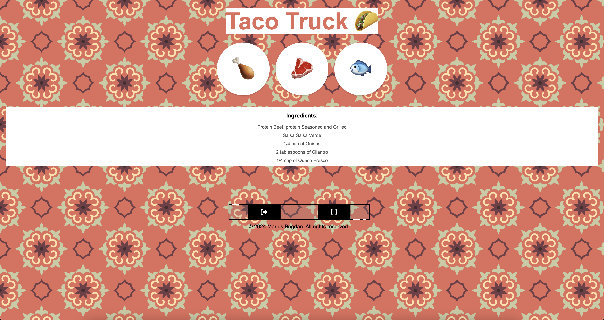

# Taco Truck App

[](#)
> A dynamic web application that allows users to explore different taco recipes by selecting various protein options.

## Overview

**Taco Truck App** is an interactive food application where users can choose between chicken, beef, or fish tacos to view their ingredients and preparation details. It provides a simple and engaging way to learn about different taco recipes.

## Preview

<p align="center">
  
</p>

## Features

- **Protein Selection:** Users can choose between chicken, beef, or fish tacos.
- **Ingredient Display:** Shows a list of ingredients for the selected taco.
- **Preparation Details:** Provides step-by-step instructions for making the taco.

## Live Demo

**Explore the live version here:** [View Live Demo](https://marius-bogdan.com/projects/taco-truck/)

## Local Setup

1. **Clone** the repository:
   ```bash
   git clone https://github.com/MIBogdan/taco-truck.git
   ```
2. **Navigate** to the project folder:
   ```bash
   cd taco-truck
   ```
3. **Install** dependencies:
   ```bash
   npm install
   ```

4. **Run** the application:
   ```bash
   npm start
   ```
- The development server will open automatically in your default browser.
- **If it doesn't open automatically**,manually visit: http://localhost:3000 in your browser.

4. **Terminate** the server:
- **On macOS/Linux:** Press `Control + C` in the terminal. 
- **On Windows:** Press `Ctrl + C` in the Command Prompt or PowerShell. 
---

## Author

**Marius Bogdan**  
[Personal portfolio](https://marius-bogdan.com/)

Feel free to reach out for any questions or collaborations!

## License

This project is provided for testing and demonstration purposes only. All rights are reserved. No part of this project may be redistributed, reuploaded, or used in any manner (commercially or otherwise) without explicit written permission from the author.
